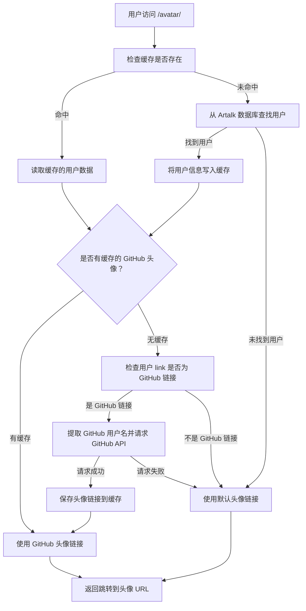

# 主要收集的信息以及目的

> 为了减少收集你的数据，我们尽可能的使用Github Oauth2登陆方式。这样可以不收集你的账户和密码，仅需要收集你的邮箱和IP。
{.is-info}

## NS Wiki（本站）
**https://nswiki.cn/**
| 收集的数据 | 收集目的 |
| ----------- | ---------- |
| 邮箱    | 作为身份标识符，鉴权用。 |
| IP地址  | 防止滥用，分析网站数据。 |

## 下载站
**https://dl.awa.cool/** **https://download.nswiki.cn/**
| 收集的数据 | 收集目的 |
| ----------- | --------------------- |
| IP          | 进行基础访问记录与安全防护。 |

## 评论站
**https://artalk.awa.cool/**
| 收集的数据 | 收集目的 |
| ----------- | ---------- |
| 邮箱         | 作为身份标识符，鉴权用。 |
| IP地址       | 防止滥用。 |
| User-Agent  | 用于评论显示设备类型。 |

## 头像站
**https://gravatar.awa.cool/**
非常的曲线救国。
